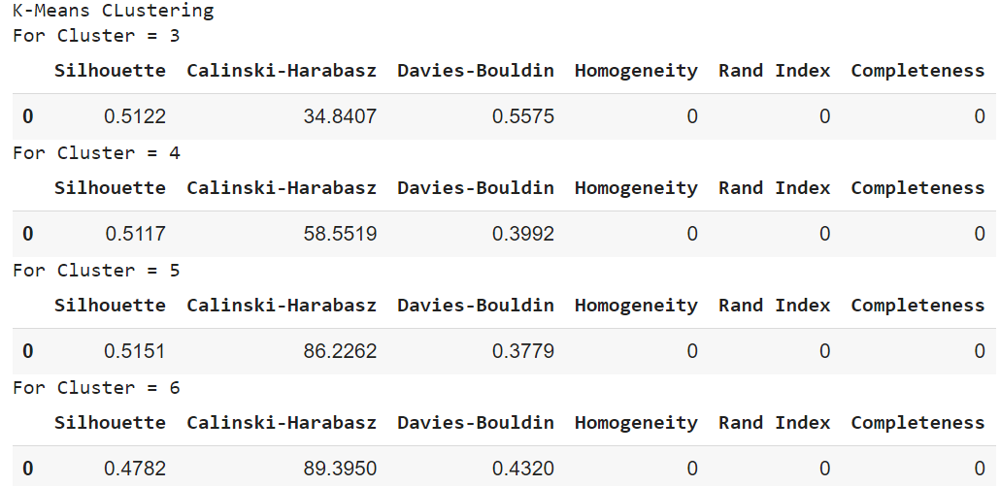
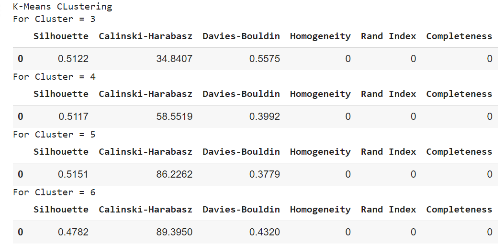
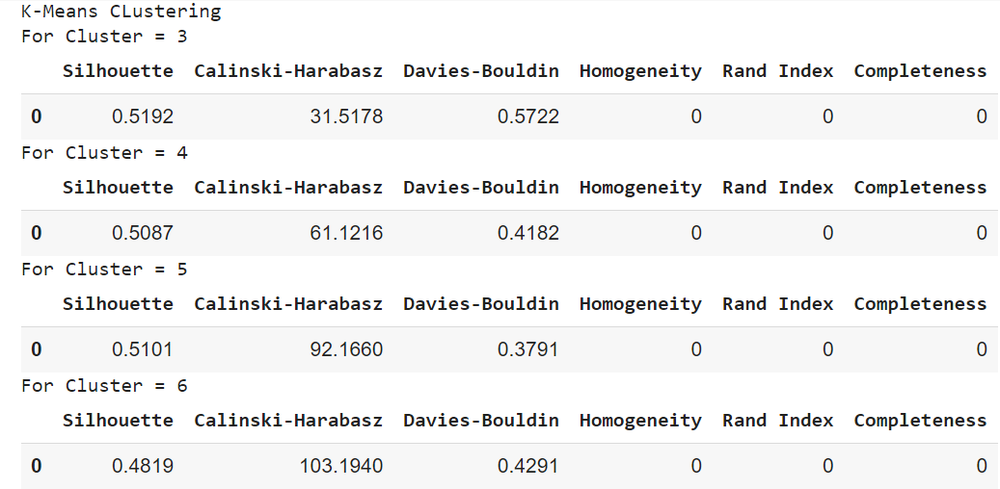

# Clustering
Comparitive performance study of different clustering algorithms using different pre-processing techniques with different numbers of clusters on different evaluation parameters.

## **1. Methodology**
1. Select a dataset.
2. Choose different clustering algorithms.
3. Apply different clustering algorithms using different pre-processing techniques with different numbers of clusters. .
4. Compare the results obtained.

## **2. Clustering Algorithms Used**
1. K-Means Clusterimg
2. Agglomerative Clustering
3. OPTICS Clustering

## **3. Pre-Processing Techniques Used**
1. Normalization
2. Transformation
3. PCA
4. Normalization+Transformation
5. Normalization+Transformation+PCA

## **4. Result**
K-Means performs the best with 5 clusters using Transformation, Normalization and PCA.

Transformation

Normalization

PCA

